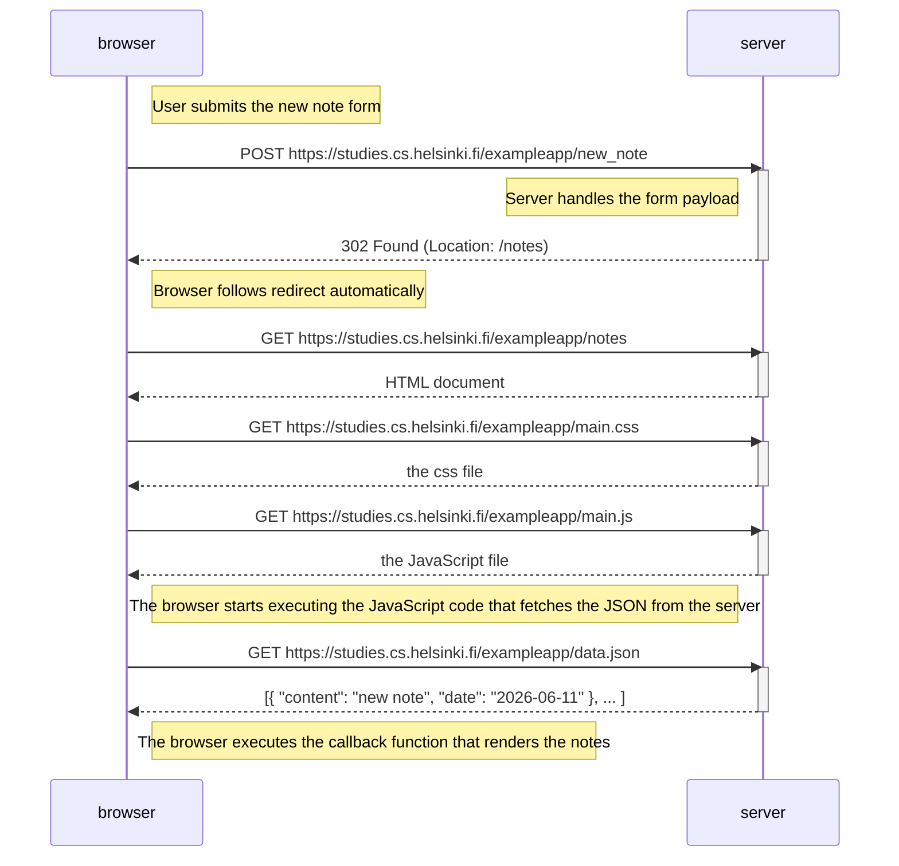

# Sequence diagram of the browser-server communication when creating a new note

```mermaid
sequenceDiagram
    participant browser
    participant server

    Note right of browser: User submits the new note form

    browser->>server: POST https://studies.cs.helsinki.fi/exampleapp/new_note
    activate server
    
    Note left of server: Server handles the form payload

    server-->>browser: 302 Found (Location: /notes)
    deactivate server

    Note right of browser: Browser follows redirect automatically

    browser->>server: GET https://studies.cs.helsinki.fi/exampleapp/notes
    activate server
    server-->>browser: HTML document
    deactivate server

    browser->>server: GET https://studies.cs.helsinki.fi/exampleapp/main.css
    activate server
    server-->>browser: the css file
    deactivate server

    browser->>server: GET https://studies.cs.helsinki.fi/exampleapp/main.js
    activate server
    server-->>browser: the JavaScript file
    deactivate server

    Note right of browser: The browser starts executing the JavaScript code that fetches the JSON from the server

    browser->>server: GET https://studies.cs.helsinki.fi/exampleapp/data.json
    activate server
    server-->>browser: [{ "content": "new note", "date": "2026-06-11" }, ... ]
    deactivate server

    Note right of browser: The browser executes the callback function that renders the notes
```
